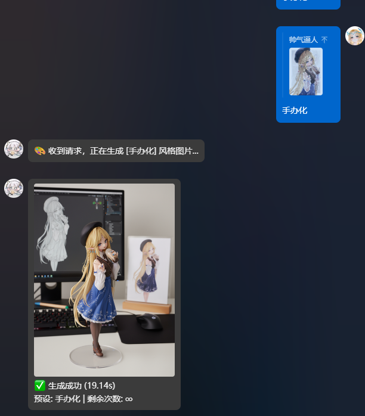
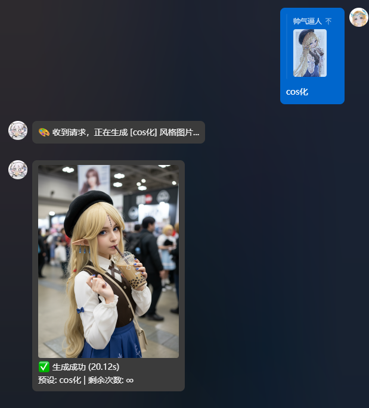
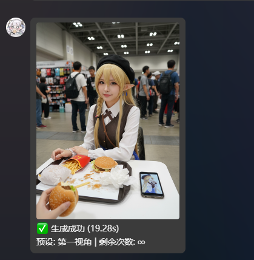
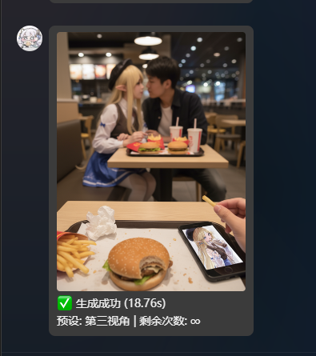

# 支持 gemini 路由
公开仓库：https://github.com/misaka-link/astrbot_plugin_shoubanhua

征求api请求格式 请提ls  看到了可以考虑融合在一起
# docker部署输出lm列表的时候全是符号 解决办法 请运行 
apt update 

apt install -y fonts-dejavu fonts-noto fonts-freefont-ttf

手动部署请什root权限运行（针对linux）
# 通过第三方柏拉图api调用 Banana的api使用
注册地址 [柏拉图1]( https://api.bltcy.ai/register?aff=dcc39044557)
# 原先bnn涨价原因
因为nano-banana涨价到0.08一次毫无性价比，上了自定义模型建议全部换成gemini-2.5-flash-image-preview、gemini-2.5-flash-image。
测试下来效果是一样的
## 功能特性
- **多风格转换**：内置十几种指令，如 `#手办化`、`#Q版化`、`#痛车化`、`#鬼图` 等，满足不同场景需求。
- **自定义生成**：使用 `#bnn <提示词>` 指令，可以完全自定义 Prompt 进行创作；也可用 `#bnn*2 <提示词>` 并发生成多次。
- **灵活的输入方式**：支持直接发送图片、回复图片、或`@用户`来使用其头像进行制作。
- **强大的管理功能 (管理员限定)**：
  - **Key 管理**：通过指令动态添加、查看、删除 API Key，支持配置多个 Key 并自动轮换使用。
  - **用户次数管理**：可为普通用户设置使用次数，并通过指令进行增加和查询，实现轻量级付费或激励机制。
- **高度可定制**：所有指令的默认提示词（Prompt）都在后台配置文件中开放，也可按模型指定最终提示词模板。
- **代理支持**：内置 HTTP / SOCKS5 代理支持，方便在特殊网络环境下部署。

## 安装与配置

### 安装

2.  将该文件夹放入 `astrbot/plugins` 目录下。
3.  重启 AstrBot。

### 配置

在 AstrBot 管理面板的 `插件管理` -> `手办工坊 Pro` 中进行配置。常用项说明：

| 配置项 | 说明 |
| --- | --- |
| `generic_api_url` | Generic 模式 API 地址。支持 Base URL 或完整端点 URL，插件会按端点模型列表拼接/切换 `/v1/chat/completions`、`/v1/images/generations`、`/v1/images/edits` |
| `generic_api_keys` | Generic 模式 Key 池（可多条轮询），示例：123 |
| `gemini_api_url` | Gemini 端点地址，默认 https://generativelanguage.googleapis.com |
| `gemini_api_keys` | Gemini 路由 Key 池 |
| `model_list` | 可用模型 ID 列表，默认包含 nano-banana 等 |
| `gemini_model_list` | 命中后走 Gemini 端点的模型列表 |
| `command_model_list` | 触发指令和模型名绑定列表，不改变默认触发指令 |
| `model_prompt_template_list` | 预设提示词列表，按模型指定最终发送给绘图接口的提示词模板 |
| `model_parameter_list` | 模型参数设置列表；可设置模型默认扣次，并在 Images Generations / Edits 端点按模型发送 `quality`、`moderation` 和启用后的自适应 `size` |
| `chat_completions_model_list` | 走 `/v1/chat/completions` 的模型列表。端点模型列表为空或模型未匹配时，也默认走该端点 |
| `images_generations_model_list` | 走 `/v1/images/generations` 的模型列表。常用于文生图 |
| `images_edits_model_list` | 走 `/v1/images/edits` 的模型列表。常用于带图请求，插件会用 multipart/form-data 上传图片 |
| `model` | 默认模型（需在模型列表中存在），示例：gemini-2.5-flash-preview-image |
| `show_model_info` | 是否在成功/失败消息中显示实际调用模型 |
| `debug_mode` | 调试模式，开启后报错会附加完整错误内容 |
| `send_error_reason` | 默认报错中展示上游返回的简短原因 |
| `send_error_context` | 默认报错中展示 request_id、endpoint、model 等定位信息 |
| `error_default_message` / `error_400_message` 等 | 自定义错误模板。支持 `{status_code}`、`{elapsed}`、`{detail}`、`{provider_message}`、`{model}`、`{endpoint_type}`、`{endpoint}`、`{request_id}` 等变量 |
| `prefix` | 是否需要命令前缀或 @ 才触发 |
| `extra_prefix` | 自定义提示词前缀（如 bnn，用 bnn <prompt> 调用） |
| `preset_list_command` | 预设/提示词列表触发指令，默认 lm列表 |
| `preset_list_template` | 预设列表图片模板，默认读取 `templates/preset_list.html` |
| `batch_multiplier_symbol` | 批量生成倍率符号，默认 `*`，如 `#bnn*2 一只小猫` |
| `resolution_symbol` | 临时覆盖模型自适应分辨率的符号，默认 `x`；`x1/x2/x4` 对应 `1K/2K/4K`，可与批量倍率任意排序组合 |
| `default_batch_count` | 未写倍率时的默认批量数，默认 1 |
| `max_batch_multiplier` | 单次指令最大生成倍率，可填 1-100，扣次按实际倍率计算 |
| `max_batch_concurrency` | 批量生成最大并发数，可填 1-20，倍率更大时会排队执行 |
| `use_proxy` / `proxy_url` | 启用代理与代理地址（支持 `http(s)://` 或 `socks5://` 等格式） |
| `timeout` | 请求超时（秒），默认 120 |
| `use_stream` | Generic 模式是否走流式请求。仅 `chat/completions` 路径有效，`images/generations` 不使用流式 |
| `download_retries` | 图片下载重试次数 |
| `help_text` | 自定义 #手办化帮助 文本 |
| `user_whitelist` / `user_blacklist` | 用户白/黑名单 |
| `group_whitelist` / `group_blacklist` | 群聊白/黑名单，白名单群不限制次数；全局管理员可无视群黑名单 |
| `enable_user_limit` / `enable_group_limit` | 是否启用用户/群组次数限制 |
| `resolution_1k_cost` / `resolution_2k_cost` / `resolution_4k_cost` | 有效分辨率参数每次生成的扣除次数，默认分别为 1、2、4 |
| `failure_deduction_status_codes` | 失败仍扣次的 HTTP 状态码列表，默认仅 `400`；留空时失败均不扣次 |
| `enable_failure_deduction_status_codes` | 是否只按失败扣次错误码列表扣次，默认开启；关闭后所有失败都会扣次 |
| `enable_checkin` | 是否启用每日签到获取次数 |
| `checkin_fixed_reward` | 签到固定奖励（未开启随机时） |
| `enable_random_checkin` / `checkin_random_reward_max` | 签到随机奖励开关与最大值 |
| `prompt_list` | 预设提示词列表，每项包含 `指令` / `提示词`；旧 `触发词:提示词` 会自动迁移 |

> 路径说明：建议把 `generic_api_url` 填成上游 Base URL 或任一完整端点 URL，然后在三个端点模型列表中按模型分流；未填写或未匹配的模型默认走 `/v1/chat/completions`。同一模型同时配置在 `images_generations_model_list` 和 `images_edits_model_list` 时，文生图走 `/v1/images/generations`，图生图走 `/v1/images/edits`。

> 默认生成开始消息会显示当前调用端点简名，例如 `端点: edits`。自定义 `custom_img2img_start_message` 或 `custom_text2img_start_message` 只有包含 `{endpoint}` 时才显示端点，不再自动追加。

> 每次提交生图请求前，插件日志会输出请求方式、最终 URL、路由、请求头和全部非图片生图参数。API Key 会显示为 `<redacted>`，图片字段仅显示 `<image omitted>`，不会输出图片内容、Base64 或图片摘要。Images Edits 的其他 multipart 字段会逐项展开记录。

> 使用 SOCKS 代理时，需要在 AstrBot 的 Python 环境中先执行 `pip install aiohttp_socks`。

### 按模型预设提示词模板

`model_prompt_template_list` 用于给不同模型配置不同的最终提示词模板。命中模型后，插件会用该模板替换默认英文包装提示词；未命中模型时保持原逻辑。

可用变量：

- `{prompt}`：用户输入或预设展开后的提示词内容。
- `{model}`：本次实际调用模型。
- `{mode}`：生成模式，值为 `文生图` 或 `图生图`。
- `{image_count}`：输入图片数量。
- `{default_prompt}`：插件原本默认包装后的完整提示词。

配置示例：

| 模型 | 提示词模板 |
| --- | --- |
| `gemini-2.5-flash-image` | `请根据以下内容直接生成图片，不要解释：{prompt}` |
| `nano-banana` | `{default_prompt}` |

### 模型参数设置

`model_parameter_list` 使用与“触发指令模型绑定”相同的列表对象形式，按模型配置 Images Generations 和 Images Edits 请求参数。

- `模型`：填写模型列表或端点模型列表中的模型名。
- `质量`：可选 `low`、`medium`、`high`、`auto`，默认 `auto`。
- `审核`：可选 `auto`、`low`。`auto` 为标准过滤；`low` 的过滤限制较少。
- `自适应比例`：默认关闭。开启后，带图的 Images 请求会读取第一张图片宽高比并计算满足 Images API 约束的 `size` 参数。
- `自适应比例分辨率`：可选 `1K`、`2K`、`4K`，默认 `1K`。开启自适应比例后默认使用此值；命令中的 `x1/x2/x4` 可临时覆盖。
- `默认扣除次数`：当前模型未启用有效自适应分辨率时，每次生成默认扣除多少次，默认 1。

自适应尺寸统一遵守以下规则：宽高都是 16 的倍数、最长边不超过 3840、长短边比例不超过 3:1，总像素不少于 655,360 且不超过 8,294,400。`1K` 和 `2K` 分别以 1024、2048 为目标最长边，`4K` 以 3840 为目标最长边；若目标尺寸超出总像素范围，会等比放大或缩小后再对齐到 16。

例如第一张图是 `1920x1080`（16:9）：模型配置为 `1K` 时提交 `size=1088x608`（`1024x576` 低于最小总像素，因此自动放大）；使用 `#bnnx2` 临时覆盖后提交 `size=2048x1152`；使用 `#bnnx4` 提交 `size=3840x2160`。竖图会交换宽高；方图 4K 会受最大总像素限制，提交 `2880x2880`。比例超过 3:1 的首图会按 3:1 上限计算。插件只增加请求参数，不会缩放或修改上传的原图。

请求携带图片、当前模型开启“自适应比例”并实际走 `/v1/images/generations` 或 `/v1/images/edits` 时，插件会按模型配置的分辨率增加 `size`；命令带 `x1/x2/x4` 时以命令值为准。未配置模型、关闭自适应比例、Chat Completions 和 Gemini 路由均不提交 `size`，并按模型默认次数扣除。

最终生效的 `1K/2K/4K` 分别按 `resolution_1k_cost`、`resolution_2k_cost`、`resolution_4k_cost` 扣次，默认是 1、2、4 次；自适应分辨率未生效时按模型的“默认扣除次数”扣次。最后再乘批量倍率，例如默认配置下 `#bnn*2x4` 共扣 `4 x 2 = 8` 次。

次数按每个请求的实际结果结算：生成成功正常扣次。`enable_failure_deduction_status_codes` 开启时，生成失败只有 HTTP 状态码命中 `failure_deduction_status_codes` 才扣次，默认仅状态码 `400` 会扣；关闭时，所有失败都会扣次。批量生成逐个结果结算。

配置示例：

| 模型 | 质量 | 审核 | 自适应比例 | 自适应比例分辨率 | 默认扣除次数 |
| --- | --- | --- | --- | --- | --- |
| `gpt-image-1` | `high` | `auto` | 开启 | `2K` | `1` |
| `gpt-image-1-mini` | `medium` | `low` | 关闭 | `1K`（不生效） | `2` |

## 使用方法

- **发送图片**并使用命令。
- **引用**含有图片的消息并使用命令。
- **@某人**并使用命令 (将使用该用户的头像)。

---
## 新增

新增签到系统，文生图功能和自定义模型。

### 本次更新

- 后台新增触发指令与模型绑定列表，配置项位于最上方。
- 后台新增按模型配置的预设提示词列表，可覆盖不同模型最终收到的提示词模板。
- 后台新增模型参数设置列表，支持为 Images Generations / Edits 模型指定质量与审核参数。
- 模型参数设置新增自适应比例开关和 `1K/2K/4K` 默认分辨率；分辨率符号（默认 `x`）可用 `x1/x2/x4` 临时覆盖，并支持与批量倍率任意排序组合。
- 新增 `1K/2K/4K` 扣次配置和模型默认扣次配置。
- 新增失败扣次错误码列表，默认仅 HTTP `400` 失败会扣次。
- 新增失败扣次错误码限制开关；关闭后所有失败都会扣次。
- 生图请求发送前记录全部非图片参数，API Key 脱敏且图片字段不输出内容。
- 移除后台 `gemini_official` / API 模式切换，改为 `gemini_model_list` 自动路由。
- 预设列表改为 HTML 模板渲染，模板位于 `templates/preset_list.html`。
- `prompt_list` 改为对象列表，并自动兼容/导入旧字符串格式。
- 新增默认批量数 `default_batch_count`，默认 1。
## 📖 命令列表

### 基础与新增命令（合并）

| 命令 | 功能说明 |
| :--- | :--- |
| `#文生图 <描述>` | 文生图：输入描述生成图片 |
| `#自定义 <提示词>` | 搭配图片使用自定义提示词进行图生图（回复/携带图片） |
| `#手办化` | 生成角色的手办造型，偏向立体模型展示 |
| `#手办化2` | 生成另一种风格的手办造型，可能是细节或比例的不同 |
| `#手办化3` | 生成不同版本的手办展示，更偏系列感 |
| `#手办化4` | 生成手办化第四种风格，可能是更精致或特殊造型 |
| `#手办化5` | 生成另一种改良版手办造型 |
| `#手办化6` | 生成手办化的第六种衍生风格 |
| `#Q版化` | 生成Q版（可爱简化比例）的角色形象 |
| `#痛屋化` | 生成痛屋（贴满角色元素装饰的房间）场景 |
| `#痛屋化2` | 生成改良版痛屋场景，更丰富或现代感 |
| `#痛车化` | 生成痛车（贴有角色图案的车辆）造型 |
| `#cos化` | 生成角色cosplay化的照片风格 |
| `#cos自拍` | 生成角色自拍风格的cos照片 |
| `#孤独的我` | 生成孤独、滑稽或小丑化的意境图 |
| `#第三视角` | 生成第三人称视角场景，看起来像他人在看角色 |
| `#鬼图` | 生成灵异鬼图风格照片，带恐怖氛围 |
| `#第一视角` | 生成第一人称视角场景，沉浸感强 |
| `#贴纸化` | 生成贴纸风格的小图，方便做表情或周边 |
| `#玉足` | 生成角色玉足相关的画面或细节 |
| `#fumo化` | 生成毛绒玩偶（fumo）风格角色 |
| `#cos相遇` | 生成两位cos角色相遇的场景 |
| `#三视图` | 生成角色三视图（正面、侧面、背面） |
| `#穿搭拆解` | 生成角色服装穿搭的详细拆解图 |
| `#拆解图` | 生成模型拆解或零件展示图 |
| `#角色界面` | 生成类似游戏中角色信息界面的画面 |
| `#角色设定` | 生成角色设定图，包含全身、武器、细节等 |
| `#3D打印` | 生成适合3D打印的模型预览图 |
| `#微型化` | 生成微缩模型、小比例角色形象 |
| `#挂件化` | 生成挂件、钥匙扣风格的角色造型 |
| `#姿势表` | 生成角色姿势参考表，多种动作合集 |
| `#高清修复` | 对画面进行高清化、细节修复 |
| `#人物转身` | 生成人物转身动作的连续画面 |
| `#绘画四宫格` | 生成四宫格绘画对比图或进度展示 |
| `#发型九宫格` | 生成九种不同发型的对比图 |
| `#头像九宫格` | 生成九个不同风格的头像合集 |
| `#表情九宫格` | 生成角色九种不同表情合集 |
| `#多机位` | 生成多机位拍摄的场景视角合集 |
| `#电影分镜` | 生成电影风格的分镜图 |
| `#动漫分镜` | 生成动漫风格的分镜图 |
| `#真人化` | 生成角色的真人化形象（真实感较强） |
| `#真人化2` | 生成另一种风格的真人化形象 |
| `#半真人` | 生成半写实半动漫的混合风格 |
| `#半融合` | 生成角色与其他元素融合的半融合风格 |

### 自定义与查询

| 命令 | 功能说明 |
| :--- | :--- |
| `#bnn <提示词>` | 使用自定义提示词生成 |
| `#bnn*2 <提示词>` | 使用倍率并发生成 2 次，倍率符号可在后台配置 |
| `#bnnx4 <提示词>` | 临时覆盖为 4K 分辨率；仅在当前模型开启自适应比例且请求带图时生效 |
| `#bnn*2x4` / `#bnnx4*2` | 使用 4K 分辨率并批量生成 2 次，两种顺序都支持 |
| `#手办化查询次数` | 查询自己的剩余次数 |

### 👑 管理命令 (仅主人)

| 命令 | 功能说明 |
| :--- | :--- |
| `#手办化添加key <key1>...` | 添加一个或多个API密钥 |
| `#手办化key列表` | 查看API密钥列表 |
| `#手办化删除key <序号\|all>` | 删除API密钥 |
| `#手办化增加次数 <QQ号> <次数>` | 为用户增加使用次数 |
| `#手办化查询次数 <QQ号>` | 查询指定用户剩余次数 |

---

## 🎨 效果展示

*以下图片均为插件实际生成效果。*

| `#手办化` | `#cos化` |
| :---: | :---: |
|  |  |
| **#第一视角** | **#第三视角** |
|  |  |

## 注
本插件是基于维拉大佬写的js改的。 感谢维拉大佬的支持
